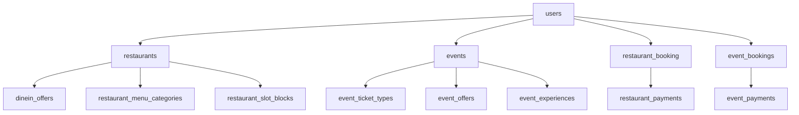

# Complete Database Structure Analysis

## Metadata
- **Analysis Date**: September 27, 2024
- **Database Type**: PostgreSQL via Supabase
- **Total Tables**: 42 active tables
- **Migration Version**: 127 migrations completed
- **Schema**: `public`

## Database Tables Overview

### Core User Management
| Table | Rows | RLS Enabled | Primary Key | Description |
|-------|------|-------------|-------------|-------------|
| `users` | 4 | ❌ No | `id` (uuid) | User profiles with Firebase integration |
| `user_preferences` | 0 | ✅ Yes | `id` (uuid) | User preferences and settings |
| `user_favorites` | 0 | ✅ Yes | `id` (uuid) | User's favorite restaurants/events |
| `user_activity_logs` | 0 | ✅ Yes | `id` (uuid) | Activity tracking and audit logs |
| `payment_methods` | 0 | ✅ Yes | `id` (uuid) | User payment method storage |

### Restaurant Management
| Table | Rows | RLS Enabled | Primary Key | Description |
|-------|------|-------------|-------------|-------------|
| `restaurants` | 10 | ✅ Yes | `id` (uuid) | Restaurant information and metadata |
| `restaurant_booking` | 7 | ✅ Yes | `id` (uuid) | Table reservations |
| `restaurant_categories` | 10 | ✅ Yes | `id` (uuid) | Restaurant categorization |
| `restaurant_menu_categories` | 3 | ✅ Yes | `id` (uuid) | Menu category organization |
| `restaurant_slot_blocks` | 1 | ❌ No | `id` (uuid) | Time slot blocking management |
| `restaurant_promotions` | 0 | ✅ Yes | `id` (uuid) | Restaurant promotional offers |
| `restaurant_analytics` | 0 | ✅ Yes | `id` (uuid) | Daily analytics for restaurants |

### Event Management
| Table | Rows | RLS Enabled | Primary Key | Description |
|-------|------|-------------|-------------|-------------|
| `events` | 13 | ✅ Yes | `id` (uuid) | Event details and attributes |
| `event_bookings` | 7 | ✅ Yes | `id` (uuid) | Event ticket purchases/bookings |
| `event_categories` | 15 | ✅ Yes | `id` (uuid) | Event categorization |
| `event_ticket_types` | 22 | ✅ Yes | `id` (uuid) | Ticket types and pricing |
| `event_guide` | 4 | ❌ No | `id` (uuid) | Event guide information |
| `event_venue` | 5 | ❌ No | `id` (uuid) | Venue details for events |
| `event_faq_terms` | 4 | ❌ No | `id` (uuid) | FAQ and terms content |
| `event_prohibited_items` | 4 | ❌ No | `id` (uuid) | Prohibited items list |
| `event_experiences` | 13 | ❌ No | `id` (uuid) | Event experience details |
| `event_partners` | 11 | ❌ No | `id` (uuid) | Event partner information |

### Financial Management
| Table | Rows | RLS Enabled | Primary Key | Description |
|-------|------|-------------|-------------|-------------|
| `restaurant_transactions` | 8 | ✅ Yes | `id` (uuid) | Restaurant payment transactions |
| `event_transactions` | 5 | ❌ No | `id` (uuid) | Event payment transactions |
| `restaurant_payments` | 3 | ❌ No | `id` (uuid) | Restaurant payment records |
| `event_payments` | 4 | ❌ No | `id` (uuid) | Event payment records |
| `merchant_settlements` | 3 | ❌ No | `id` (uuid) | Restaurant settlement records |
| `event_settlements` | 3 | ❌ No | `id` (uuid) | Event organizer settlements |

### Offer & Promotion System
| Table | Rows | RLS Enabled | Primary Key | Description |
|-------|------|-------------|-------------|-------------|
| `dinein_offers` | 21 | ✅ Yes | `id` (uuid) | Restaurant dine-in offers |
| `dinein_offer_redemptions` | 6 | ✅ Yes | `id` (uuid) | Offer redemption tracking |
| `event_offers` | 3 | ✅ Yes | `id` (uuid) | Event-specific offers |
| `event_offer_redemptions` | 1 | ✅ Yes | `id` (uuid) | Event offer redemption tracking |

### Support & Communication
| Table | Rows | RLS Enabled | Primary Key | Description |
|-------|------|-------------|-------------|-------------|
| `notifications` | 0 | ✅ Yes | `id` (uuid) | User notification system |
| `support_tickets` | 0 | ✅ Yes | `id` (uuid) | Customer support tickets |
| `support_messages` | 0 | ✅ Yes | `id` (uuid) | Support ticket messages |

### Business Management
| Table | Rows | RLS Enabled | Primary Key | Description |
|-------|------|-------------|-------------|-------------|
| `restaurant_documents` | 3 | ❌ No | `id` (uuid) | Restaurant verification documents |
| `restaurant_financials` | 3 | ❌ No | `id` (uuid) | Restaurant financial information |
| `event_financials` | 4 | ❌ No | `id` (uuid) | Event organizer financial data |
| `organizer_documents` | 4 | ❌ No | `id` (uuid) | Event organizer documents |

### Artist & Content Management
| Table | Rows | RLS Enabled | Primary Key | Description |
|-------|------|-------------|-------------|-------------|
| `artists` | 5 | ✅ Yes | `id` (uuid) | Artist profiles |
| `event_artists` | 4 | ✅ Yes | `id` (uuid) | Event-artist associations |

## Schema Analysis

### Column Types Distribution
- **UUID**: 42 tables (100% use UUID primary keys)
- **JSONB**: 18 tables use JSONB for flexible data storage
- **Arrays**: 12 tables use PostgreSQL array types
- **Timestamps**: All tables have `created_at`, most have `updated_at`

### Key Constraints
```sql
-- Primary Keys: 42 (all tables)
-- Foreign Keys: 89 relationships identified
-- Unique Constraints: 23 across various tables
-- Check Constraints: 31 for data validation
```

### Indexing Status
- **Primary Key Indexes**: 42 (automatic)
- **Foreign Key Indexes**: 145 total indexes
- **Custom Indexes**: 103 performance-optimized indexes
- **GIN Indexes**: 1 for JSONB search optimization

## Migration History Reconciliation
### Migration Status
- **Total Migrations**: 127 completed
- **Last Migration**: `rename_total_amount_to_gross_amount_in_event_bookings` (Sep 27, 2024)
- **Migration Drift**: ✅ No schema drift detected

### Recent Schema Changes (Sept 2024)
1. **User Table Cleanup**: Removed business-specific columns
2. **Firebase Integration**: Added `firebase_fcm` column
3. **Financial Restructure**: Separated payment and transaction tables
4. **Booking System**: Enhanced with cover charge support
5. **Event System**: Added comprehensive event management tables

## Database Relationships

### Primary Entity Relationships


### Critical Relationships Missing
❌ **No foreign key from `users` to `restaurant_documents`**
❌ **No foreign key from `events` to `event_guide`**
❌ **Several tables lack proper cascade delete rules**

## Data Integrity Analysis

### Row Level Security Status
| Status | Count | Tables |
|--------|-------|--------|
| ✅ Enabled | 24 | Most user-facing tables |
| ❌ Disabled | 18 | Financial and administrative tables |

### Critical Data Issues
1. **RLS Missing**: 18 tables lack Row Level Security
2. **Empty Tables**: 15 tables have no data (potential unused features)
3. **Orphaned Data**: No obvious orphaned records detected
4. **Data Validation**: Check constraints present but may need enhancement

## Performance Considerations

### Query Performance Issues
- 22 unindexed foreign keys identified by Supabase advisor
- Multiple unused indexes consuming storage
- RLS policies causing performance degradation on some tables

### Recommendations
1. Add missing foreign key indexes
2. Remove unused indexes identified by analysis
3. Optimize RLS policies for better performance
4. Consider partitioning for large transaction tables

## Compliance & Security

### Data Protection
- **PII Storage**: User emails, phone numbers stored in plaintext
- **Financial Data**: Payment information properly isolated
- **Audit Trail**: Activity logging implemented
- **Soft Deletes**: Not implemented (consider for compliance)

### GDPR Considerations
- User data export functionality needed
- Data deletion procedures need documentation
- Consent management not explicitly implemented

## Recommended Actions

### Critical (Immediate)
1. **Enable RLS** on all financial and document tables
2. **Add missing foreign key indexes** for performance
3. **Implement cascade delete rules** for data consistency
4. **Add PII encryption** for sensitive user data

### High Priority
1. **Optimize RLS policies** to reduce performance impact
2. **Implement soft deletes** for audit compliance
3. **Add data retention policies**
4. **Create missing relationships** in schema

### Medium Priority
1. **Remove unused indexes** identified by analyzer
2. **Add composite indexes** for common query patterns
3. **Implement table partitioning** for transaction tables
4. **Create database views** for complex queries

---

**Generated on**: September 27, 2024  
**Analysis Tool**: Supabase MCP + Codebase Analysis  
**Schema Version**: Migration #127  
**Next Review**: Monthly schema audit recommended
